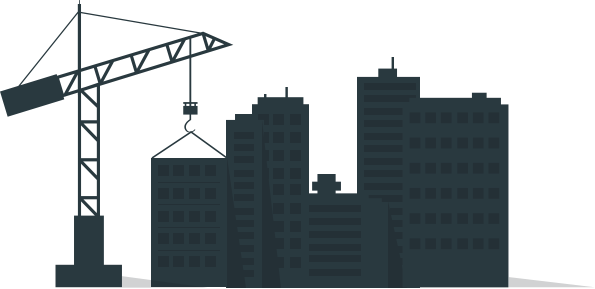

  

    

    
    

      Helping people grow ideas into sustainable companies.
    

    
BOUNDLESS

    

      It takes more than a great technology idea to build a great company. An
      idea is a catalyst, but great companies turn that idea into a sustainable
      business model. Sustainable companies focus on revenue from day one, they
      aspire to delight customers, grow in a controlled way, and improve
      economies long term. We think sustainable companies are a great place to
      invest our time and money, so that's what we do.
    

    

      <a href="venture-partners">VENTURE PARTNERSHIPS</a>
      <a href="coaching">COACHING</a>
      <a href="appdevelopment">APP DEVEVELOPMENT</a>
      <a href="#wevebeenbuilding">ABOUT</a> <a href="#askboundlesscopy">ASK</a>
    

    

      VENTURE PARTNERSHIPS     COACHING     APP DEVEVELOPMENT     ABOUT     ASK
    

    
Ask Boundless

    
Over a Decade of Building

    
Sign up for Curated Content

    

      Join our email newsletter and we’ll send you curated articles about being
      an entrepreneur.
    

    

      Quora LinkedIn Twitter Google+ Medium Email
    

    
    
    

      © 2018 BOUNDLESS Proudly owned and operated in Phoenix,
      Arizona  522 North Central Ave #292 Phoenix, AZ 85001
    

    
Your Name

    
Email

    

      

      
SIGN UP

    

    

    
WORK WITH US

    
    
    
    

    

    

    

      We've been building apps with early-stage companies for over a decade,
        and we've got the processes nailed down pretty well. If you're starting
        a business around a web or mobile app, we can get your budding company
        off the ground. We've got a couple different programs to do that,
        depending on the stage you're in:  Newbie If you're just getting started and need expert guidance, then
        some consulting help will whip your idea into shape. We'll define your
        target market, their problem/solution set, and the pricing to complete
        your offer. A little bit of planning and validation goes a long way to
        ensure you're building an app that people want.  Partner-ready If you've gone through our Lean App Foundation program
        already, or have done the customer discovery yourself, you might be a
        great fit to partner with us. We invest time, money, or both with the
        right type type of early-stage company. To find out if yours qualifies,
        head over to the Venture Partnerships page and take a look!
    

    

      Where do I start with an app idea? Mar 17, 2017 What do you think about my revolutionary idea? Jun 15, 2017 What exactly is an MVP? Feb 4, 2017
    

  

